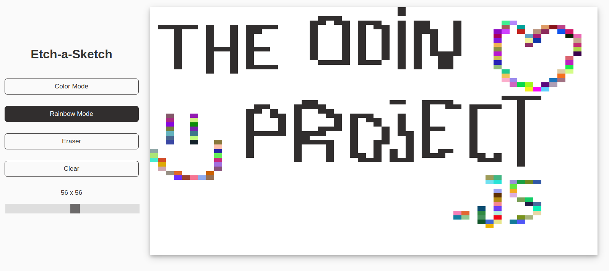

# Etch-a-Sketch



This application allows the user to draw anything on a canvas with the mouse and it is the submission for [The Odin Project: Etch-a-Sketch](https://www.theodinproject.com/lessons/foundations-etch-a-sketch). The key features are:

- Color & Rainbow Mode
- Erase / Clear Functionality
- Customizable Canvas
- Cross-Browser Compatibility


## Live Demo

[Etch-a-Sketch](https://jesusgraterol.github.io/etch-a-sketch/)


## Getting Started

### Requirements

- GIT

### Installation

1) Clone the repository
```bash
git clone git@github.com:jesusgraterol/etch-a-sketch.git
```

## Usage

Open the `index.html` file with your favorite browser.

## Built With

- HTML5
- CSS3
- JavaScript

## Running the Tests

### Unit Tests

N/A

### Integration Tests

N/A

### E2E Tests

N/A

## @TODO

- Allow the user to set a custom color

## License

[MIT](https://choosealicense.com/licenses/mit/)

## Acknowledgments

- [Google Fonts](https://fonts.google.com/icons)